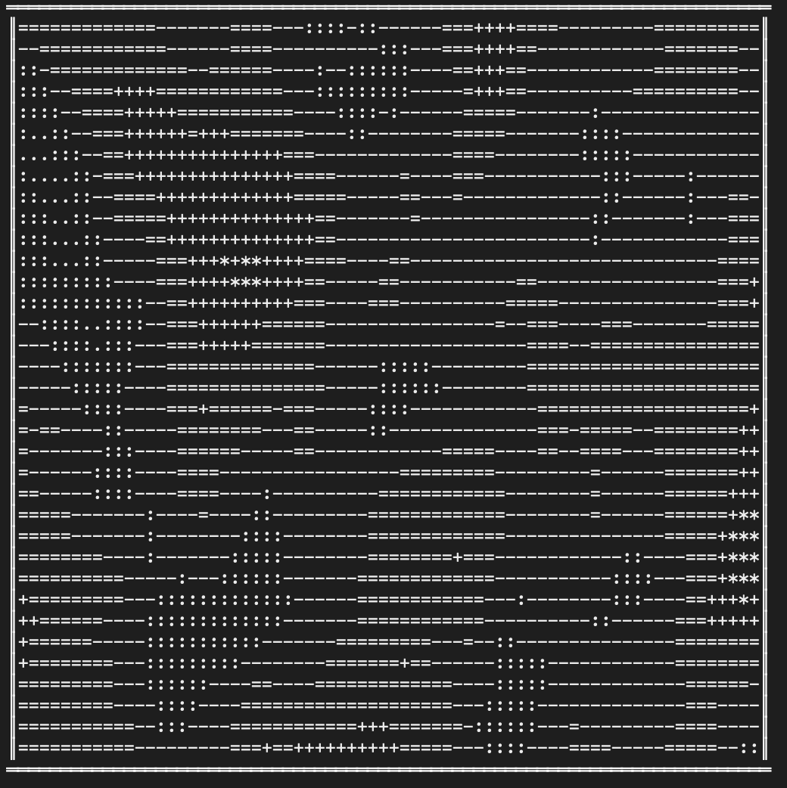
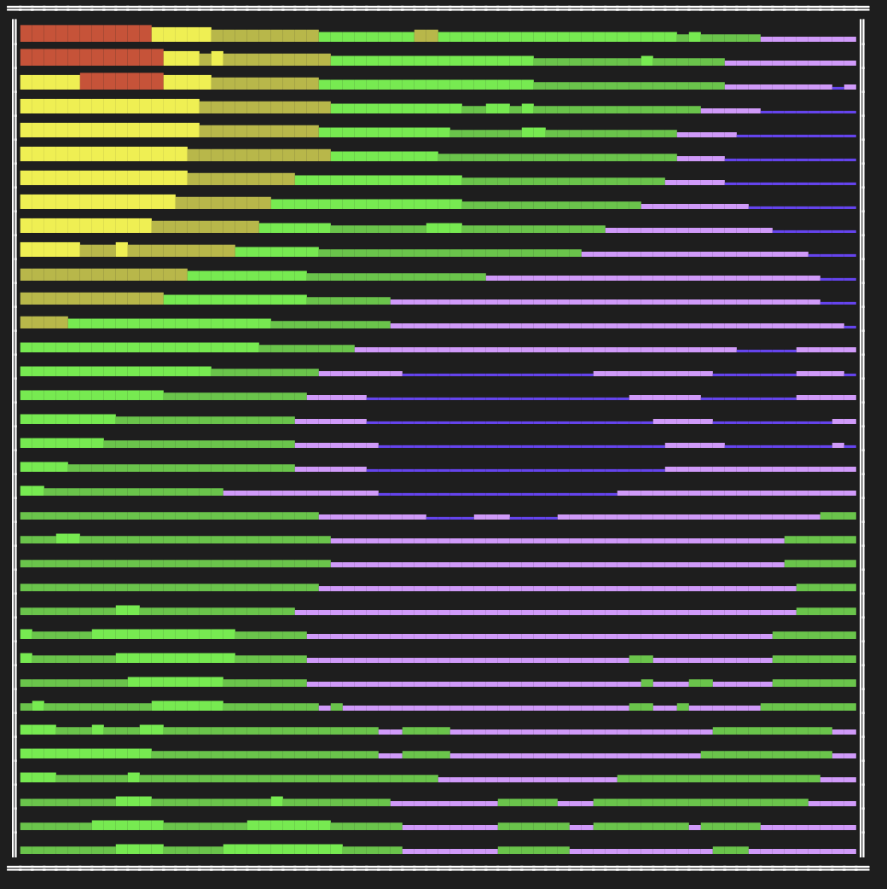

# Terminal Procedural Terrain Generator

A C# console application that generates and visualizes procedural terrain generation using various algorithms. The application provides a simple, interactive interface for generating and viewing different types of terrain within your terminal.

## Features

- **Multiple Terrain Generators**: Random noise, Perlin noise, and Midpoint Displacement algorithms
- **Flexible Visualization**: Choose from different rendering styles to visualize your terrain
- **Interactive Interface**: Simple menu-driven interface for generating and viewing terrain
- **Extendable Architecture**: Easily add new terrain generatoring algorithms and renderers

## Screenshots


Example of Perlin noise terrain with black and weight renderer



Example of Midpoint Displacement terrain with colour renderer

## Requirements

- .NET 8.0

## Installation

1. Clone this repository:
   ```
   git clone https://github.com/olliewakeford/Terminal-Procedural-Terrain-Generation.git
   ```

2. Navigate to the project directory:
   ```
   cd Terminal-Procedural-Terrain-Generation
   ```

3. Build the project:
   ```
   dotnet build
   ```

4. Run the application:
   ```
   dotnet run
   ```

## Usage

After starting the application, you'll be presented with a menu interface:

1. **Select a Terrain Generator**:
   - Enter the number corresponding to the generator you want to use
   - Each generator creates terrain using a different algorithm

2. **Change the Renderer**:
   - Press 'R' to access the renderer menu
   - Select a different visualization style for your terrain

3. **Exit the Application**:
   - Press '0' to exit

## Available Terrain Generators

### Random Terrain
Generates completely random height values without any coherence. Useful for testing and as a baseline comparison for other algorithms.

### Perlin Noise Terrain
Creates natural-looking terrain with smooth, continuous features resembling hills and valleys. Perlin noise generates natural-looking results with multiple octaves of detail.

### Midpoint Displacement
Implements the diamond-square algorithm to create fractal-like terrain. Creates heights by recursively subdividing the terrain and adding random displacements, resulting in natural-looking mountains and valleys.

## Available Renderers

### Black & White Renderer
Visualizes terrain using ASCII characters, with different characters representing different elevation levels. Works in any console environment without color support.

### Color Height Renderer
Visualizes terrain using block characters with color gradients representing different elevations. Provides a more visually striking representation of elevation changes.

## Project Structure

- **Models**: Contains the terrain data structures and interfaces
- **TerrainGenerators**: Contains the terrain generation algorithms
- **Renderers**: Contains the visualization components
- **Exceptions**: Contains custom exception types
- **Services**: Contains factory classes and utilities
- Program.cs runs and controls the main program
- TerrainGenerator.cs handles the whole application
